# Progress Pride
  - [Description](#an-lgbtqia-pride-themed-watchface)
  - [Screenshots](#screenshots)
  - [Flags and Icons](#flags-and-icons)
    - [Flags](#flags)
    - [Icons](#icons)
  - [Flag Requests and Issues](#flag-requests-and-issues)
  - [License](#license)

An LGBTQIA+ Pride themed watchface
---

A stats-heavy watch face featuring LGBTQIA+ flags and icons.

Choose your flag, complete with it's iconography, then customize by choosing a different icon, time font color, and time background opacity.

Tap the screen to toggle through all the stats at the bottom of the watch face.
 
 
 
 
You can find it in the Fitbit App Gallery and get it for yourself by clicking the icon below:

---
## Screenshots
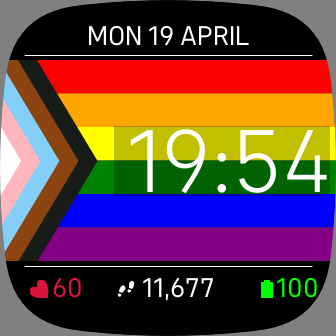
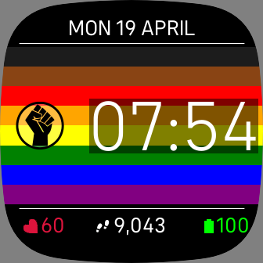
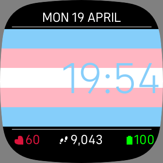
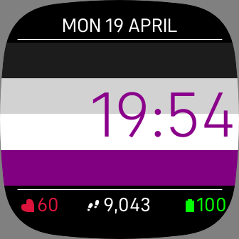
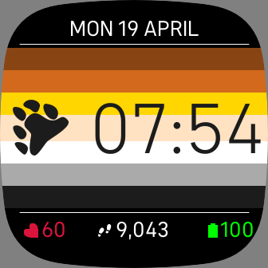
---
# Flags and Icons
Below you can see thumbnails of all the flags and icons currently available in this watchface. 

The Progress Pride and Intersex flags have had some _artistic license_ taken with their layout, to work better with the watchface.

The icons have been taken directly from the flags' reference images, and are included separately so you can pick and choose to customize your watchface.

### Flags
| Name | Image | Default Icon |
| --- | --- | --- |
| Progress Pride |  | none |
| Philadelphia Pride | 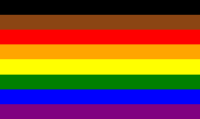 | none |
| Gilbert Baker Pride | 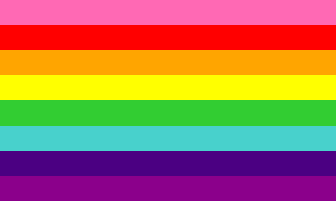 | none |
| Gilbert Baker Diversity Pride | 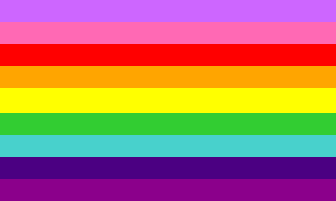 | none |
| Pride 1978 | 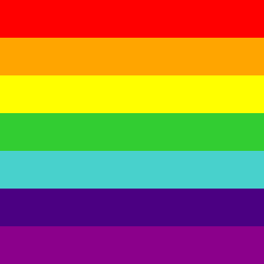 | none |
| Pride | 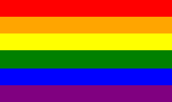 | none |
| Agender | 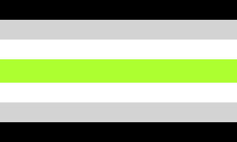 | none |
| Ally |  | 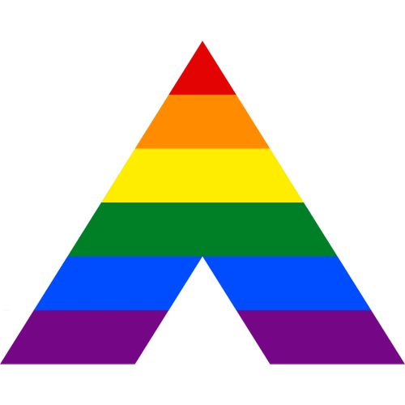 |
| Aromantic |  | none |
| Asexual |  | none |
| Bear Pride |  |  |
| Bisexual | 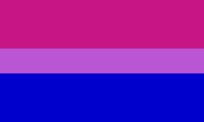 | none |
| Gay Mens' Pride |  | none |
| Genderfluid | 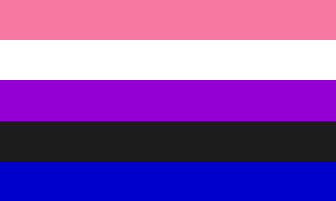 | none |
| Genderqueer |  | none |
| Intersex |  | none |
| Leather Pride | 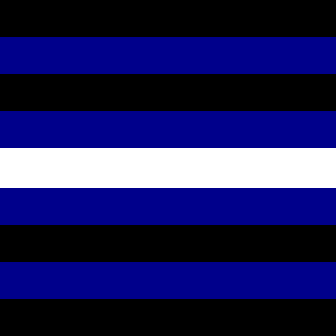 |  |
| Lesbian Labrys |  | 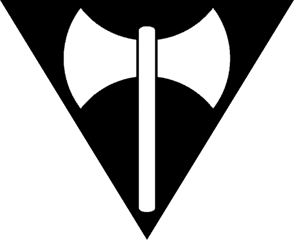 |
| Lesbian | 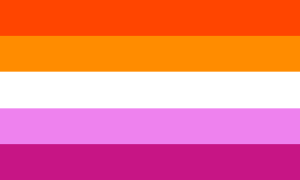 | none |
| Lipstick Lesbian | 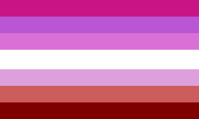 |  |
| Non-binary |  | none |
| Pansexual |  | none |
| Polyamory |  |  |
| Polysexual |  | none |
| Transgender |  | none |

### Icons
| Name | Image |
| :--- | ---: |
| Black Lives Matter Fist |  |
| Ally Chevron |  |
| Leather Flag Heart |  |
| Lipstick Lesbian Kiss |  |
| Lesbian Labrys |  |
| Bear Paw |  |
| Polyamory Pi |  |
| Polyamory Infinity Heart |  |

---
## Flag Requests and Issues
If you'd like to see a flag added to this watchface, please submit a [Flag Request](https://github.com/bjhawk/fitbit-clockface-progress/issues/new?assignees=&labels=flag-request&template=flag-request.md&title=).

Found an issue with the watchface? Submit a [Bug Report](https://github.com/bjhawk/fitbit-clockface-progress/issues/new?assignees=&labels=bug&template=bug_report.md&title=).

## License
This project is open source, and conforms to the [MIT License](https://github.com/bjhawk/fitbit-clockface-progress/blob/main/LICENSE)